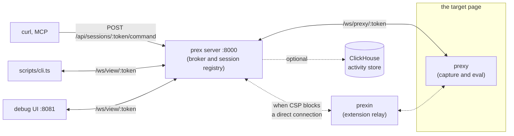

# prex

A reverse tunnel into a live browser tab. `prex` is the server; `prexy` is the tiny
agent a bookmarklet loads into a target page. Once `prexy` is running
on a page, you can run JS in it, watch its console/network traffic, and
hot-reload the capture logic,  all over plain HTTP/WebSocket, without
touching the browser again. (If CSP/CORS is an issue, see `prexin` browser extension relay project)



> [!TIP]
> Use a local or reverse proxy setup with websocket upgrade for `prex server`

## Quickstart

Build the prexy bundle and start the server:

```bash
cd prexy && deno task build
cd ../apps/server && PREX_ADMIN_KEY=<pick-a-key> deno task dev
```

Generate a bookmarklet for a session:

```bash
cd prexy && deno task bookmarklet -- --server http://localhost:8000
```

Save the printed `javascript:...` URL as a browser bookmark, click it on
the target page, then either:

- run the debug UI: `cd apps/ui && npm run dev`, open it, fill in the
  server URL + admin key, pick the session, use the REPL,  or
- hit the HTTP API directly:
  ```bash
  curl -X POST http://localhost:8000/api/sessions/<token>/command \
    -H "Authorization: Bearer <key>" -H "Content-Type: application/json" \
    -d '{"code":"document.title"}'
  ```

## Deployment

```bash
cp .env.example .env   # set PREX_ADMIN_KEY
docker compose up -d --build
```

Builds and runs two containers:  `prex` (the server, `:8000`) and
`prex-dbg-ui` (the optional debug UI, `:8081`),  both expecting a reverse proxy
(e.g. nginx) in front for TLS. The proxy needs WebSocket upgrade headers on
`/ws/prexy/` and `/ws/view/`.

### Activity store (optional)

By default nothing is persisted: captured activity lives in the target page's
own ring buffer, and triggers live in memory

Enabling the store adds a third container (`prex-clickhouse`) and makes captured
activity and triggers durable  activity stays queryable after a page reload or
a server restart, observation answers for sessions whose page is closed, and
triggers survive a restart without any client reconnecting. Set these in
`.env`:

```bash
COMPOSE_PROFILES=store
PREX_CLICKHOUSE_URL=http://prex-clickhouse:8123
PREX_CLICKHOUSE_USER=prex
PREX_CLICKHOUSE_PASSWORD=$(openssl rand -hex 24)
```

`COMPOSE_PROFILES` is what starts the container; `PREX_CLICKHOUSE_URL` is what
tells prex to use it. Leave the URL empty and prex skips the store entirely,
even if the container is running.

`prex-clickhouse` publishes **no ports**  it is reachable only from inside the
compose network, which is the containment for everything it stores, including
captured request/response bodies (stored verbatim, so a target site's own
credentials can appear in them). Data lives in the `prex-clickhouse-data` named
volume and survives `docker compose down`; `docker compose down -v` discards
all stored activity and triggers.

prex never hard-depends on it: with the store absent **or merely down**,
capture, broadcasting and trigger dispatch continue unaffected.

### Knowing what is actually live

`prex` and optional `prex-dbg-ui`:

```bash
docker compose up -d --build prex          # after any apps/server or prexy change
docker compose up -d --build prex-dbg-ui   # after any apps/ui change
```

Only `./static` (and, locally, the bind-mounts in `compose.override.yaml`) are
served live from disk.


## Usage

### Server prex

1. **Set a key** `PREX_ADMIN_KEY`

2. **Start prex** `docker compose up -d`

3. **Create a token** `deno task bookmarklet -- --server http://localhost:8000`

### Target Page

1. **Run bootstrap** use a task bookmarklet `javascript:...` via bookmark, devtools or prexin

2. (Optional) **Check devtools console** usually there are some messages `[prexy] ...` that show the state 

3. **Done**

---

### Tasks

| Command | Task |
|---|---|
| `cd prexy && deno task build` | Bundle core.ts + games/*.ts into apps/server/static/prexy |
| `cd prexy && deno task bookmarklet -- --server <url> --game <id> [--token <token>]` | Print a minified, ready-to-paste bookmarklet |
| `cd prexy && deno task bookmarklet:raw -- ...` | Same, unminified, for embedding in a browser extension |
| `cd apps/server && deno task dev` | Run the server with file-watching |
| `cd apps/ui && npm run dev` | Run the debug UI (Vite) |
| `cd apps/ui && npm run build` | Production build of the debug UI |


### Game modules

`--game <name>` makes the agent load `/prexy/games/<name>.js`. The server looks in two places,
in order:

1. **Built into the image**: `prexy/games/*.ts`, bundled by `deno task build`. prex ships the
   generic ones here (`default`, `minimal`).
2. **Mounted**: `static/games/<name>.js`, served live from disk. A module written for one
   particular site belongs here, built from wherever its source lives, so it needs no rebuild
   of prex. A `window.__prexy.reload()` in the tab picks up a new build.

A module for `<name>` should expose its in-page API as `window.<name>`; that is how prex
reports it as loaded.

### (Optional) Debug UI

1. **Unlock sessions** `http://localhost:8081` by default with the `PREX_ADMIN_KEY`

2. **Select a session** will display information about the session and data

**Workbench** is UI only: a value, an ordered list of conversions, a live result.
It reports the shape at every step, says what a value
*might* be, and a recipe built there can be pinned to the field it came from so
every later occurrence renders that way (never stored).

### (Optional) Terminal client

`scripts/cli.ts` speaks the same viewer WebSocket the debug UI uses (no overhead).

```bash
export PREX_ADMIN_KEY=...
deno run --allow-net --allow-env scripts/cli.ts --list          # sessions
deno run --allow-net --allow-env scripts/cli.ts <token>         # tail the log
deno run --allow-net --allow-env scripts/cli.ts <token> --json  # NDJSON, for piping
deno run --allow-net --allow-env scripts/cli.ts <token> --repl  # interactive
```

`--repl` is the **same shared REPL** the browser UI has: what you type appears in
its log, and vice versa. It shows eval/result only, matching the browser's REPL
panel, run a second plain `cli.ts <token>` in another pane for the log tail.

Wrap with `rlwrap` for history and line editing. (works over SSH):

```bash
docker compose exec -it prex rlwrap \
  deno run --allow-net --allow-env scripts/cli.ts <token> --repl
```

### (Optional) Manual Client prexy

1. **Find the session.** `GET /api/sessions` (bearer admin key) lists live tokens/games/URLs.
2. **Call relevant code** `POST /api/sessions/:token/command  {"code": "<js>", "silent": true}` 
   - `prexy` the capture profile: hooks fetch/WS, exposes `window.<game>` (`apiCall`, `log`, pause/resume, snapshots).
   - `prex_modules` are loaded on top of the capture profile via `loadModule()`.
   - (Optional) `prexin` the browser extension that relays prexy's control channel through an extension background worker, for target sites with a restrictive CSP/CORS that a plain bookmarklet connection can't get through.
3. **Inspect live state** `POST /api/sessions/:token/command  {"code": "<js>", "silent": true}` which runs arbitrary JS in the live page, returns the result over HTTP. `silent:true` skips broadcasting to the debug UI's log/REPL.
4. **Inspect live logic code** `document.getElementById("<module-host-id>").shadowRoot.querySelectorAll(...)` Fetch its same-origin `<script src>` bundles (via the same `/command` eval) and regex-search the text. Pierce the shadow root if the module mounts isolated, as this one does via `attachShadow({mode:"open"})` (`discoverInScripts`).
5. **Push code into the *already-connected* tab** without a manual page reload, via the same `/command` eval endpoint, running JS *in the page*:
   - Capture module: `window.__prexy.reload()` re-fetches `prexy` from prex's own server.
   - Any other loaded module `window.__prexy.loadModule(url)` but is cache-busted per call by design and intended as hot-swap path (safe to call repeatedly without touching the page).
   - Exception: Restarting server drops in-memory sessions, but `prexy` auto-reconnects with the same token on its own.


### (Optional) Anomaly detection

#### 1. The in-page detector
A generic prexy module that watches whatever the loaded capture
module emits and notices when a message type falls silent, a rate moves, or a payload's shape
changes. It knows nothing about any target and needs no change to any capture module.

```
POST /api/sessions/:token/command
{"code": "window.__prexy.loadModule('http://localhost:8000/static/prex-detect/detect.js')"}
```

Inspect it with `window.__prexDetect.stats()`; remove it with `window.__prexDetect.unload()`.

It also distils high-volume traffic into per-minute summaries. That matters because a target can
declare a short retention for its chattiest message type  on one real target that type is ~85% of
all captured bytes and is kept for **48 hours**, while the summaries describing it are kept for
**30 days**, at a measured ~243x smaller. So the detail expires but its shape does not.

What it emits are ordinary captured events (`finding` and `summary`), so they flow through the
storage and trigger machinery. An ordinary trigger acts on one:

```
match: "event:finding" //webhook or eval, exactly like any other trigger
```

Two things worth knowing before you rely on it:

- It is driven by **message arrival, never a timer**  timers are throttled in backgrounded tabs
  while WebSocket delivery is not, so it keeps working. The flip side is that it notices
  a *type* going quiet, not the *session* going quiet: if all traffic stops, nothing runs. Use a
  `prexy-disconnected` trigger for that.
- A type is ignored until it has a baseline (10 complete minutes), so a newly-seen or genuinely
  idle type is never reported as an anomaly.

#### 2. The retrospective analysis
It answers "what changed, and when did it
start?" over stored history using only read-only MCP tools, and works on sessions whose page is
closed. 

> [!IMPORTANT]
> Nothing schedules it; that is your own infrastructure.


Its most important property is that it refuses to guess: it checks for recording gaps, page
reloads and retention boundaries *before* concluding anything, because each of those looks exactly
like a real behavioural change if you do not check.

## FAQ

- **How do I configure/set up environment variables?**
  - copy/rename the `.env.example` to `.env` and set `PREX_ADMIN_KEY`
  - change `compose.yaml` key of `environment: PREX_ADMIN_KEY`

- **Why is my module load not working without a page reload ?**
  - a fetch/WebSocket-*hooking* fix specifically still needs a real page reload
  - monkey-patched `window.fetch`/`WebSocket` from before the module shipped stays installed across a mere game-module reload (only a real navigation resets them to native)

- **How do I run a one-off js file?**
  - Use the REPL on `window.<game>` or for a complete custom use `POST`
  - `curl -s -X POST http://localhost:8000/api/sessions/:token/command -H "Authorization: Bearer $PREX_ADMIN_KEY" -H "Content-Type: application/json" --data-binary @<(jq -n --rawfile code "example.js" '{code:$code}')`

- **Why am I getting `{ ok: false, ... timeout}` ?**
  - you did not click the bookmark after a page reload (get a browser extension to do it for you)
  - while using `prexin` (adds an additional connection layer): the page is not responding

- **I got `security policy violation` stuck with `WebSocket connect timeout`, can you help?**
  - use `prexin` browser extension to add a relay for CSP/CORS
  - or create a `prexy` transport for connection and evaluator for module loads outside the page (browser engine)

- **Does it support mobile?**
  - prexy yes, technically as long as it is a "normal" browser with websocket/js

- **Can I use a WebAssembly module ?**
  - wasm-pack/Rust and AssemblyScript does that or write that instantiation glue yourself
  - use eval channel, since it is just calling `WebAssembly.instantiate(...)`
  - a target page whose CSP `script-src` lacks both 'unsafe-eval' and
   'wasm-unsafe-eval' can not run `prexycp`, just `prexy`

- **Will you create a bot/AI to play "browser-game" for me?**
  - No.

*mirror prex-beta-20-g776e629 `2d2a1fad9e94a903d56a29ab3114b15b2be15aefaffe719a22450b978541f208`*